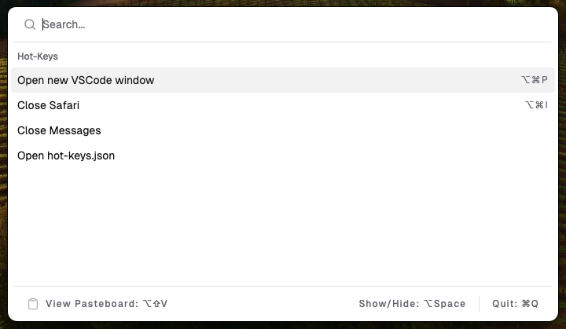

<div align="center">
    
</div>

# Hot-Keys 

Two main features:

1. Map commands to keyboard shortcuts (or execute them throught the UI)
2. Pasteboard

<div align="center">
    
</div>

## Built with

- [**Electron**](https://www.electronjs.org)
- [**React**](https://react.dev)
- [**shadcn/ui**](https://ui.shadcn.com)
- [**cmdk**](https://github.com/pacocoursey/cmdk)
- [**tailwindcss**](https://tailwindcss.com)
- [**Geist Font**](https://github.com/vercel/geist-font/blob/main/LICENSE.txt)

## Quick Start

Download and install the latest release.

Hot-Keys will read from a `hot-keys.json` file in your **_home directory_**.

### Example hot-keys.json

```bash
cd ~
```

```bash
touch hot-keys.json
```

```bash
# if using VSCode
code hot-keys.json
```

`toggleUI`,`addToPasteboard`, and `viewPasteboard` are the "built in" accelerators.
These have defaults if they are not present.
Use an empty string if you do not want to use them.

The `commands` field is your hot-keys. The `hotKey` field is optional if you do not want to take up a keyboard shortcut.

```json
{
  "toggleUI": "Option+Space",
  "addToPasteboard": "Command+Shift+V",
  "viewPasteboard": "Option+Shift+V",
  "commands": [
    {
      "hotKey": "Option+Command+P",
      "command": "code -n",
      "displayName": "Open new VSCode window"
    },
    {
      "hotKey": "Option+Command+I",
      "command": "osascript -e 'quit app \"safari.app\"'",
      "displayName": "Close Safari"
    },
    {
      "command": "osascript -e 'quit app \"messages.app\"'",
      "displayName": "Close Messages"
    },
    {
      "command": "code ~/hot-keys.json",
      "displayName": "Open hot-keys.json"
    }
  ]
}
```

### A note on $PATH

If a command is not working, it may be due to `command not found`.

Try specifying the path to the command.

EX: `/usr/local/bin/code -n` instead of `code -n`.

You can get the path to a command via:

```bash
type -a code
```

### Pasteboard feature

This feature allows you to save items for later, and view or re-copy them.

For security reasons, Hot-Keys does not continually poll your clipboard.

Instead, you use the `addToPasteboard` hot-key (or the UI), which will read your clipboard and add it to your pasteboard.

**_There is a reason you must explicitly paste into Hot-Keys._**

**_Your clipboard may very well contain sensitive data (EX: you copied a password)._**

**_Your pasteboard is not encrypted, so please do not put sensitive data there._**

## Dev environment setup _todo_

1. Clone the repo
2. Install dependencies

```bash
npm install
```

3. Run the application

```bash
npm run start
```
